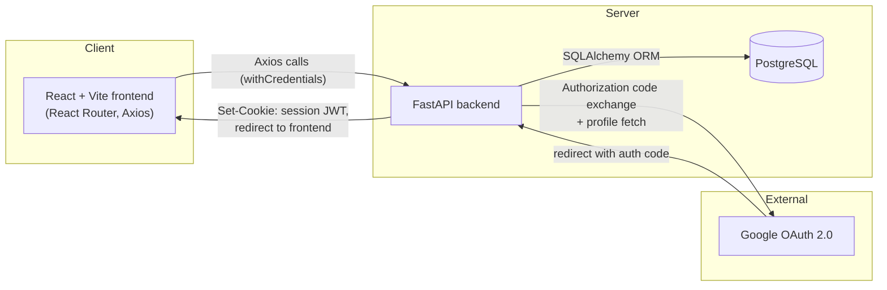
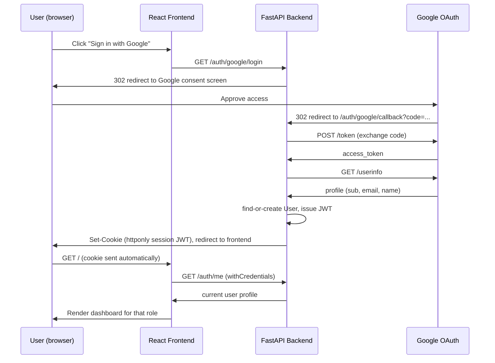
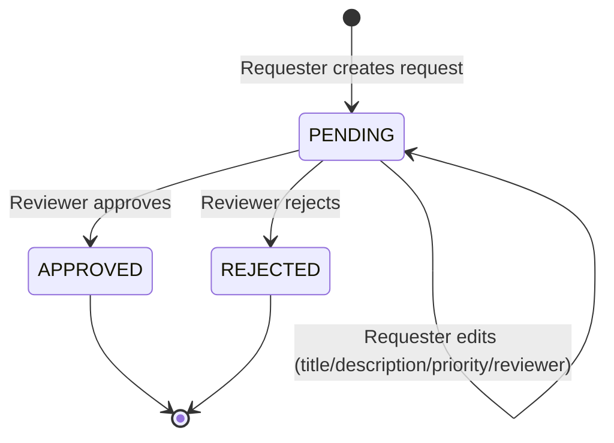

# Architecture

Built with Mermaid (one of the assessment's accepted diagramming tools).
GitHub renders Mermaid code blocks natively, so this file displays as a
diagram directly in the repo — no separate image export needed.

## System components

## Authentication sequence

## Request lifecycle

Once a request leaves `PENDING`, it's immutable: no further edits, deletes,
or review actions are accepted on it (enforced in `RequestService` and
`ReviewerService`, see `ENGINEERING_DECISIONS.md`).
